# DeepNews User Flow Architecture

이 문서는 현재 코드 기준으로 사용자가 확장 프로그램을 실행했을 때 어떤 파일, 함수, 메시지, 저장소, API가 순서대로 동작하는지 정리한 상세 아키텍처 다이어그램입니다.

현재 정책은 다음과 같습니다.

- 로그인 전에는 사이드패널에 로그인/회원가입 UI만 표시합니다.
- 로그인 전에는 기사 분석 결과 UI와 팝업 버튼을 숨깁니다.
- 로그인 전 `content-script.js`가 기사 URL을 보내도 `service-worker.js`가 분석 요청을 차단합니다.
- 로그인/회원가입 성공 후 현재 활성 탭이 네이버 뉴스 기사라면 자동으로 분석합니다.
- 백그라운드는 분석 완료 후 기사 페이지 팝업을 자동으로 띄우지 않습니다.
- 기사 페이지 팝업은 사용자가 사이드패널의 팝업 버튼을 눌렀을 때만 `panel.js`가 현재 탭으로 메시지를 보내 표시합니다.

## 1. 전체 시스템 레이어

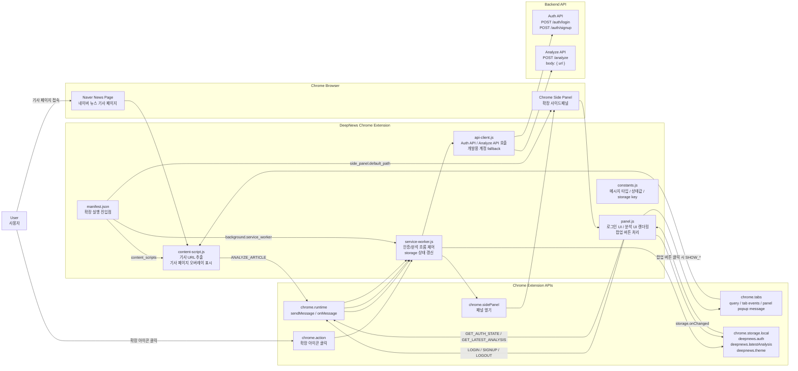
```mermaid
flowchart LR
  User["User<br/>사용자"]

  subgraph Browser["Chrome Browser"]
    NewsPage["Naver News Page<br/>네이버 뉴스 기사 페이지"]
    SidePanel["Chrome Side Panel<br/>확장 사이드패널"]
  end

  subgraph Extension["DeepNews Chrome Extension"]
    Manifest["manifest.json<br/>확장 실행 진입점"]
    CS["content-script.js<br/>기사 URL 추출<br/>기사 페이지 오버레이 표시"]
    SW["service-worker.js<br/>인증/분석 흐름 제어<br/>storage 상태 갱신"]
    Panel["panel.js<br/>로그인 UI / 분석 UI 렌더링<br/>팝업 버튼 처리"]
    ApiClient["api-client.js<br/>Auth API / Analyze API 호출<br/>개발용 계정 fallback"]
    Constants["constants.js<br/>메시지 타입 / 상태값 / storage key"]
  end

  subgraph ChromeApi["Chrome Extension APIs"]
    Runtime["chrome.runtime<br/>sendMessage / onMessage"]
    Tabs["chrome.tabs<br/>query / tab events / panel popup message"]
    Storage["chrome.storage.local<br/>deepnews.auth<br/>deepnews.latestAnalysis<br/>deepnews.theme"]
    Action["chrome.action<br/>확장 아이콘 클릭"]
    SidePanelApi["chrome.sidePanel<br/>패널 열기"]
  end

  subgraph Backend["Backend API"]
    AuthApi["Auth API<br/>POST /auth/login<br/>POST /auth/signup"]
    AnalyzeApi["Analyze API<br/>POST /analyze<br/>body: { url }"]
  end

  User -->|"기사 페이지 접속"| NewsPage
  User -->|"확장 아이콘 클릭"| Action
  Action --> SW
  SW --> SidePanelApi --> SidePanel

  Manifest -->|"content_scripts"| CS
  Manifest -->|"background.service_worker"| SW
  Manifest -->|"side_panel.default_path"| SidePanel

  NewsPage --> CS
  SidePanel --> Panel

  CS -->|"ANALYZE_ARTICLE"| Runtime --> SW
  Panel -->|"LOGIN / SIGNUP / LOGOUT"| Runtime --> SW
  Panel -->|"GET_AUTH_STATE / GET_LATEST_ANALYSIS"| Runtime --> SW
  Panel -->|"팝업 버튼 클릭 시 SHOW_*"| Tabs --> CS

  SW --> Storage
  Panel --> Storage
  Storage -->|"storage.onChanged"| Panel

  SW --> ApiClient
  ApiClient --> AuthApi
  ApiClient --> AnalyzeApi
```

## 2. manifest.json 기준 실행 진입점

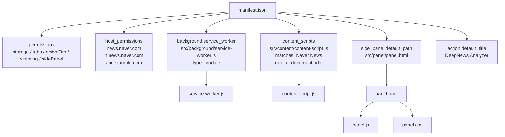
```mermaid
flowchart TD
  Manifest["manifest.json"]

  Permissions["permissions<br/>storage / tabs / activeTab / scripting / sidePanel"]
  Hosts["host_permissions<br/>news.naver.com<br/>n.news.naver.com<br/>api.example.com"]
  Background["background.service_worker<br/>src/background/service-worker.js<br/>type: module"]
  ContentScript["content_scripts<br/>src/content/content-script.js<br/>matches: Naver News<br/>run_at: document_idle"]
  SidePanelPath["side_panel.default_path<br/>src/panel/panel.html"]
  Action["action.default_title<br/>DeepNews Analyzer"]

  SW["service-worker.js"]
  CS["content-script.js"]
  PanelHtml["panel.html"]
  PanelJs["panel.js"]
  PanelCss["panel.css"]

  Manifest --> Permissions
  Manifest --> Hosts
  Manifest --> Background --> SW
  Manifest --> ContentScript --> CS
  Manifest --> SidePanelPath --> PanelHtml
  PanelHtml --> PanelJs
  PanelHtml --> PanelCss
  Manifest --> Action
```

## 3. 설치/초기화 흐름

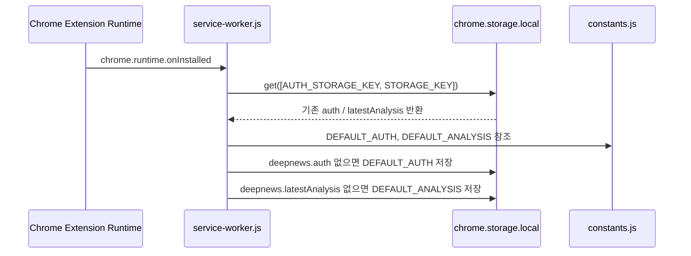
```mermaid
sequenceDiagram
  participant Chrome as Chrome Extension Runtime
  participant SW as service-worker.js
  participant Store as chrome.storage.local
  participant Constants as constants.js

  Chrome->>SW: chrome.runtime.onInstalled
  SW->>Store: get([AUTH_STORAGE_KEY, STORAGE_KEY])
  Store-->>SW: 기존 auth / latestAnalysis 반환
  SW->>Constants: DEFAULT_AUTH, DEFAULT_ANALYSIS 참조
  SW->>Store: deepnews.auth 없으면 DEFAULT_AUTH 저장
  SW->>Store: deepnews.latestAnalysis 없으면 DEFAULT_ANALYSIS 저장
```

동작 코드:

- `service-worker.js`
  - `chrome.runtime.onInstalled.addListener(...)`
- `constants.js`
  - `AUTH_STORAGE_KEY`
  - `STORAGE_KEY`
  - `DEFAULT_AUTH`
  - `DEFAULT_ANALYSIS`

## 4. 사용자 흐름 A: 비로그인 상태에서 기사 페이지 접속

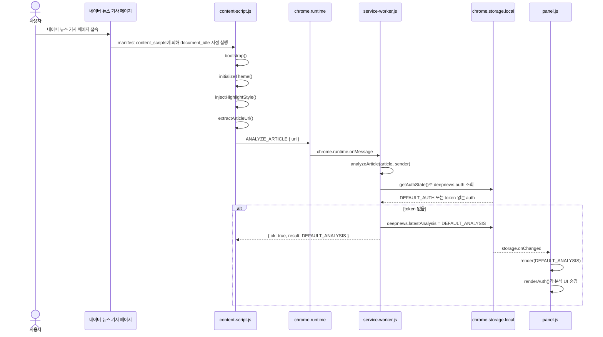
```mermaid
sequenceDiagram
  actor User as 사용자
  participant Page as 네이버 뉴스 기사 페이지
  participant CS as content-script.js
  participant Runtime as chrome.runtime
  participant SW as service-worker.js
  participant Store as chrome.storage.local
  participant Panel as panel.js

  User->>Page: 네이버 뉴스 기사 페이지 접속
  Page->>CS: manifest content_scripts에 의해 document_idle 시점 실행
  CS->>CS: bootstrap()
  CS->>CS: initializeTheme()
  CS->>CS: injectHighlightStyle()
  CS->>CS: extractArticleUrl()
  CS->>Runtime: ANALYZE_ARTICLE { url }
  Runtime->>SW: chrome.runtime.onMessage
  SW->>SW: analyzeArticle(article, sender)
  SW->>Store: getAuthState()로 deepnews.auth 조회
  Store-->>SW: DEFAULT_AUTH 또는 token 없는 auth
  alt token 없음
    SW->>Store: deepnews.latestAnalysis = DEFAULT_ANALYSIS
    SW-->>CS: { ok: true, result: DEFAULT_ANALYSIS }
    Store-->>Panel: storage.onChanged
    Panel->>Panel: render(DEFAULT_ANALYSIS)
    Panel->>Panel: renderAuth()가 분석 UI 숨김
  end
```

핵심:

- 비로그인 상태에서는 기사 URL이 추출되어도 분석 API로 가지 않습니다.
- `service-worker.js`의 `analyzeArticle()`이 `getAuthState()`로 토큰을 먼저 확인합니다.
- 토큰이 없으면 `deepnews.latestAnalysis`를 기본 상태로 되돌립니다.
- 패널은 로그인/회원가입 폼만 표시하고 `analysis-content`는 숨깁니다.

## 5. 사용자 흐름 B: 사이드패널 열기

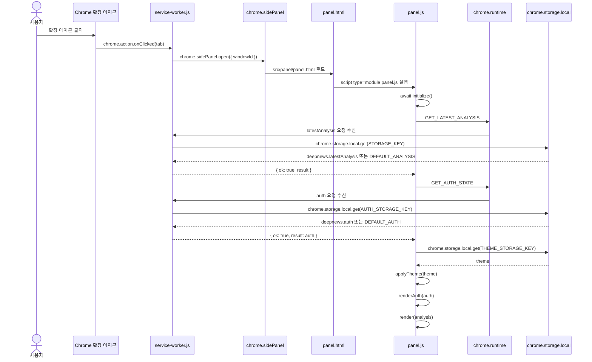
```mermaid
sequenceDiagram
  actor User as 사용자
  participant Action as Chrome 확장 아이콘
  participant SW as service-worker.js
  participant SidePanelApi as chrome.sidePanel
  participant PanelHtml as panel.html
  participant PanelJs as panel.js
  participant Runtime as chrome.runtime
  participant Store as chrome.storage.local

  User->>Action: 확장 아이콘 클릭
  Action->>SW: chrome.action.onClicked(tab)
  SW->>SidePanelApi: chrome.sidePanel.open({ windowId })
  SidePanelApi->>PanelHtml: src/panel/panel.html 로드
  PanelHtml->>PanelJs: script type=module panel.js 실행
  PanelJs->>PanelJs: await initialize()
  PanelJs->>Runtime: GET_LATEST_ANALYSIS
  Runtime->>SW: latestAnalysis 요청 수신
  SW->>Store: chrome.storage.local.get(STORAGE_KEY)
  Store-->>SW: deepnews.latestAnalysis 또는 DEFAULT_ANALYSIS
  SW-->>PanelJs: { ok: true, result }
  PanelJs->>Runtime: GET_AUTH_STATE
  Runtime->>SW: auth 요청 수신
  SW->>Store: chrome.storage.local.get(AUTH_STORAGE_KEY)
  Store-->>SW: deepnews.auth 또는 DEFAULT_AUTH
  SW-->>PanelJs: { ok: true, result: auth }
  PanelJs->>Store: chrome.storage.local.get(THEME_STORAGE_KEY)
  Store-->>PanelJs: theme
  PanelJs->>PanelJs: applyTheme(theme)
  PanelJs->>PanelJs: renderAuth(auth)
  PanelJs->>PanelJs: render(analysis)
```

패널 초기화에서 실행되는 함수:

- `initialize()`
- `applyTheme(theme)`
- `renderAuth(auth)`
- `render(analysis)`

## 6. 사용자 흐름 C: 로그인/회원가입 UI 표시

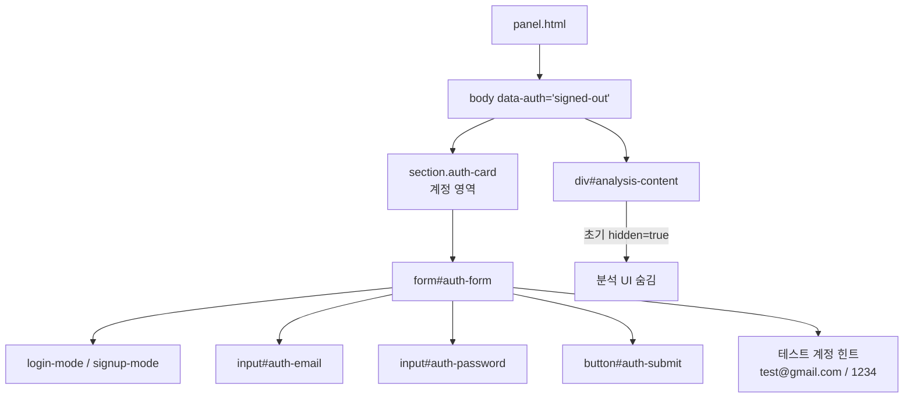
```mermaid
flowchart TD
  PanelHtml["panel.html"]
  Body["body data-auth='signed-out'"]
  AuthCard["section.auth-card<br/>계정 영역"]
  AuthForm["form#auth-form"]
  ModeButtons["login-mode / signup-mode"]
  Email["input#auth-email"]
  Password["input#auth-password"]
  Submit["button#auth-submit"]
  Hint["테스트 계정 힌트<br/>test@gmail.com / 1234"]
  AnalysisContent["div#analysis-content"]

  PanelHtml --> Body
  Body --> AuthCard --> AuthForm
  AuthForm --> ModeButtons
  AuthForm --> Email
  AuthForm --> Password
  AuthForm --> Submit
  AuthForm --> Hint
  Body --> AnalysisContent
  AnalysisContent -->|"초기 hidden=true"| Hidden["분석 UI 숨김"]
```

비로그인 상태의 UI 규칙:

- `body[data-auth="signed-out"]`
- `auth-form.hidden = false`
- `logout-button.hidden = true`
- `analysis-content.hidden = true`
- 분석 카드, 키워드, 요약, 추천, 광고성 판단, 팝업 버튼은 보이지 않습니다.

## 7. 사용자 흐름 D: 로그인 모드/회원가입 모드 전환

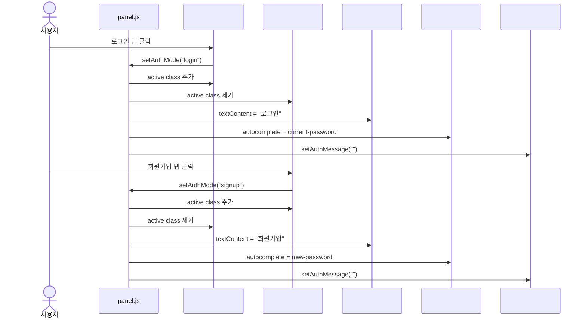
```mermaid
sequenceDiagram
  actor User as 사용자
  participant Panel as panel.js
  participant LoginBtn as #login-mode
  participant SignupBtn as #signup-mode
  participant Submit as #auth-submit
  participant Password as #auth-password
  participant Message as #auth-message

  User->>LoginBtn: 로그인 탭 클릭
  LoginBtn->>Panel: setAuthMode("login")
  Panel->>LoginBtn: active class 추가
  Panel->>SignupBtn: active class 제거
  Panel->>Submit: textContent = "로그인"
  Panel->>Password: autocomplete = current-password
  Panel->>Message: setAuthMessage("")

  User->>SignupBtn: 회원가입 탭 클릭
  SignupBtn->>Panel: setAuthMode("signup")
  Panel->>SignupBtn: active class 추가
  Panel->>LoginBtn: active class 제거
  Panel->>Submit: textContent = "회원가입"
  Panel->>Password: autocomplete = new-password
  Panel->>Message: setAuthMessage("")
```

관련 코드:

- `loginModeNode.addEventListener("click", ...)`
- `signupModeNode.addEventListener("click", ...)`
- `setAuthMode(mode)`

## 8. 사용자 흐름 E: 로그인 요청

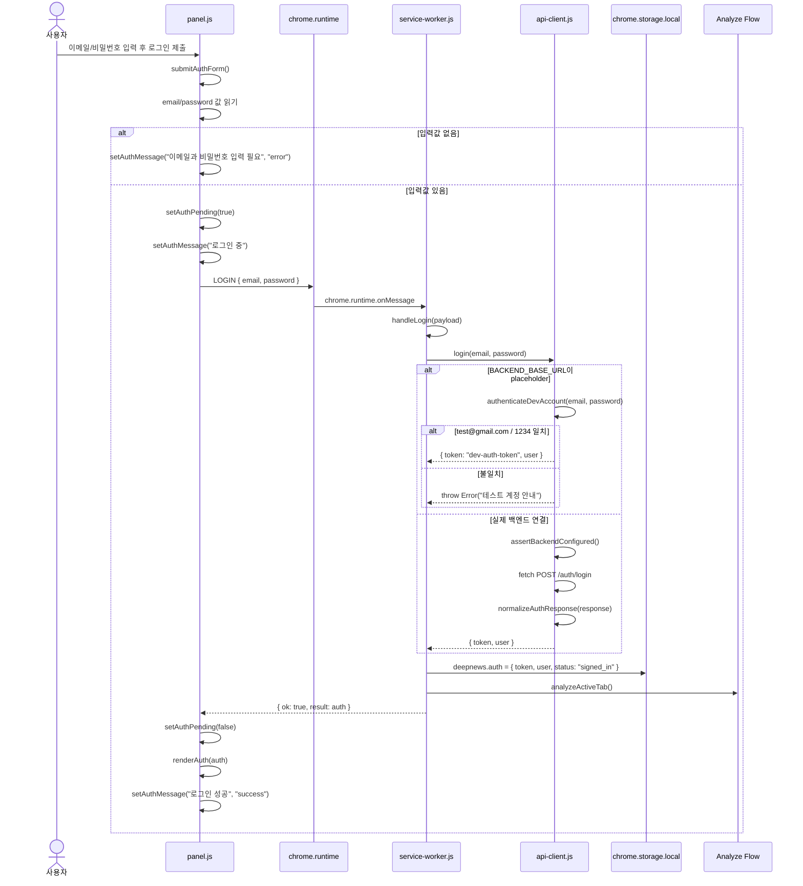
```mermaid
sequenceDiagram
  actor User as 사용자
  participant Panel as panel.js
  participant Runtime as chrome.runtime
  participant SW as service-worker.js
  participant API as api-client.js
  participant Store as chrome.storage.local
  participant Analyze as Analyze Flow

  User->>Panel: 이메일/비밀번호 입력 후 로그인 제출
  Panel->>Panel: submitAuthForm()
  Panel->>Panel: email/password 값 읽기
  alt 입력값 없음
    Panel->>Panel: setAuthMessage("이메일과 비밀번호 입력 필요", "error")
  else 입력값 있음
    Panel->>Panel: setAuthPending(true)
    Panel->>Panel: setAuthMessage("로그인 중")
    Panel->>Runtime: LOGIN { email, password }
    Runtime->>SW: chrome.runtime.onMessage
    SW->>SW: handleLogin(payload)
    SW->>API: login(email, password)
    alt BACKEND_BASE_URL이 placeholder
      API->>API: authenticateDevAccount(email, password)
      alt test@gmail.com / 1234 일치
        API-->>SW: { token: "dev-auth-token", user }
      else 불일치
        API-->>SW: throw Error("테스트 계정 안내")
      end
    else 실제 백엔드 연결
      API->>API: assertBackendConfigured()
      API->>API: fetch POST /auth/login
      API->>API: normalizeAuthResponse(response)
      API-->>SW: { token, user }
    end
    SW->>Store: deepnews.auth = { token, user, status: "signed_in" }
    SW->>Analyze: analyzeActiveTab()
    SW-->>Panel: { ok: true, result: auth }
    Panel->>Panel: setAuthPending(false)
    Panel->>Panel: renderAuth(auth)
    Panel->>Panel: setAuthMessage("로그인 성공", "success")
  end
```

로그인 성공 후 변화:

- `deepnews.auth`에 token/user 저장
- `renderAuth()`가 `body.dataset.auth = "signed-in"` 설정
- `auth-form.hidden = true`
- `logout-button.hidden = false`
- `analysis-content.hidden = false`
- 현재 활성 탭이 네이버 뉴스 기사이면 `analyzeActiveTab()`으로 자동 분석

## 9. 사용자 흐름 F: 회원가입 요청

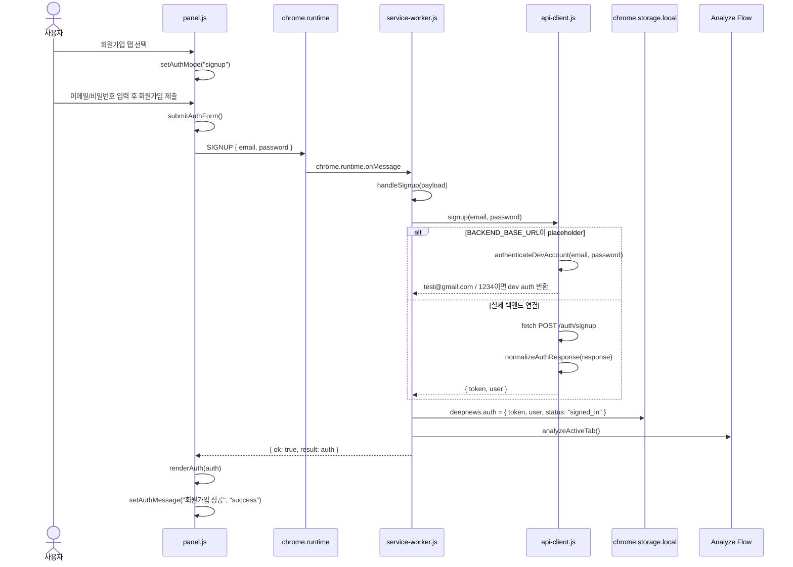
```mermaid
sequenceDiagram
  actor User as 사용자
  participant Panel as panel.js
  participant Runtime as chrome.runtime
  participant SW as service-worker.js
  participant API as api-client.js
  participant Store as chrome.storage.local
  participant Analyze as Analyze Flow

  User->>Panel: 회원가입 탭 선택
  Panel->>Panel: setAuthMode("signup")
  User->>Panel: 이메일/비밀번호 입력 후 회원가입 제출
  Panel->>Panel: submitAuthForm()
  Panel->>Runtime: SIGNUP { email, password }
  Runtime->>SW: chrome.runtime.onMessage
  SW->>SW: handleSignup(payload)
  SW->>API: signup(email, password)
  alt BACKEND_BASE_URL이 placeholder
    API->>API: authenticateDevAccount(email, password)
    API-->>SW: test@gmail.com / 1234이면 dev auth 반환
  else 실제 백엔드 연결
    API->>API: fetch POST /auth/signup
    API->>API: normalizeAuthResponse(response)
    API-->>SW: { token, user }
  end
  SW->>Store: deepnews.auth = { token, user, status: "signed_in" }
  SW->>Analyze: analyzeActiveTab()
  SW-->>Panel: { ok: true, result: auth }
  Panel->>Panel: renderAuth(auth)
  Panel->>Panel: setAuthMessage("회원가입 성공", "success")
```

현재 개발용 회원가입 정책:

- 실제 회원 생성 DB는 아직 없습니다.
- `BACKEND_BASE_URL`이 `https://api.example.com`이면 실제 API 호출 대신 개발용 계정만 통과합니다.
- 테스트 계정:
  - email: `test@gmail.com`
  - password: `1234`
- 로그인과 회원가입 모두 같은 개발용 인증 함수를 사용합니다.

## 10. 사용자 흐름 G: 로그인 후 현재 기사 자동 분석

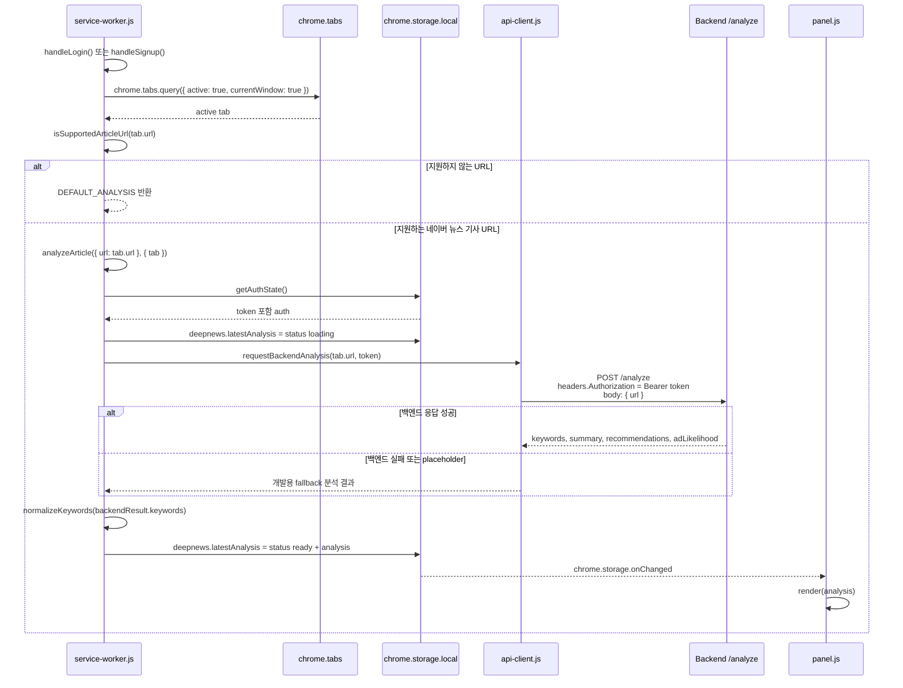
```mermaid
sequenceDiagram
  participant SW as service-worker.js
  participant Tabs as chrome.tabs
  participant Store as chrome.storage.local
  participant API as api-client.js
  participant AnalyzeApi as Backend /analyze
  participant Panel as panel.js

  SW->>SW: handleLogin() 또는 handleSignup()
  SW->>Tabs: chrome.tabs.query({ active: true, currentWindow: true })
  Tabs-->>SW: active tab
  SW->>SW: isSupportedArticleUrl(tab.url)
  alt 지원하지 않는 URL
    SW-->>SW: DEFAULT_ANALYSIS 반환
  else 지원하는 네이버 뉴스 기사 URL
    SW->>SW: analyzeArticle({ url: tab.url }, { tab })
    SW->>Store: getAuthState()
    Store-->>SW: token 포함 auth
    SW->>Store: deepnews.latestAnalysis = status loading
    SW->>API: requestBackendAnalysis(tab.url, token)
    API->>AnalyzeApi: POST /analyze<br/>headers.Authorization = Bearer token<br/>body: { url }
    alt 백엔드 응답 성공
      AnalyzeApi-->>API: keywords, summary, recommendations, adLikelihood
    else 백엔드 실패 또는 placeholder
      API-->>SW: 개발용 fallback 분석 결과
    end
    SW->>SW: normalizeKeywords(backendResult.keywords)
    SW->>Store: deepnews.latestAnalysis = status ready + analysis
    Store-->>Panel: chrome.storage.onChanged
    Panel->>Panel: render(analysis)
  end
```

중요한 현재 정책:

- `service-worker.js`는 분석 완료 후 `content-script.js`로 `SHOW_*` 메시지를 자동 전송하지 않습니다.
- 자동 팝업을 띄우지 않는 이유는 content script가 없는 탭에 메시지를 보낼 때 발생하는 `Receiving end does not exist` 오류를 막기 위해서입니다.
- 분석 결과는 `chrome.storage.local`에 저장되고, 패널은 storage 변경을 구독해 갱신됩니다.

## 11. 사용자 흐름 H: 패널 분석 UI 렌더링

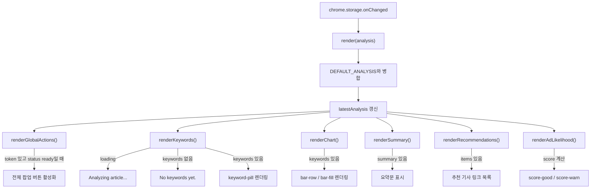
```mermaid
flowchart TD
  StorageChange["chrome.storage.onChanged"]
  Render["render(analysis)"]
  Merge["DEFAULT_ANALYSIS와 병합"]
  Latest["latestAnalysis 갱신"]
  Global["renderGlobalActions()"]
  Keywords["renderKeywords()"]
  Chart["renderChart()"]
  Summary["renderSummary()"]
  Recommendations["renderRecommendations()"]
  Ad["renderAdLikelihood()"]

  StorageChange --> Render
  Render --> Merge --> Latest
  Latest --> Global
  Latest --> Keywords
  Latest --> Chart
  Latest --> Summary
  Latest --> Recommendations
  Latest --> Ad

  Global -->|"token 있고 status ready일 때"| AllPopup["전체 팝업 버튼 활성화"]
  Keywords -->|"loading"| KeywordLoading["Analyzing article..."]
  Keywords -->|"keywords 없음"| KeywordEmpty["No keywords yet."]
  Keywords -->|"keywords 있음"| KeywordPills["keyword-pill 렌더링"]
  Chart -->|"keywords 있음"| BarChart["bar-row / bar-fill 렌더링"]
  Summary -->|"summary 있음"| SummaryText["요약문 표시"]
  Recommendations -->|"items 있음"| LinkList["추천 기사 링크 목록"]
  Ad -->|"score 계산"| Score["score-good / score-warn"]
```

패널 렌더링 함수별 책임:

- `renderGlobalActions()`
  - 전체 팝업 버튼 활성/비활성
  - `latestAuth.token`이 없으면 비활성
- `renderKeywords()`
  - 키워드 pill 렌더링
  - 키워드 팝업 버튼 활성/비활성
- `renderChart()`
  - 키워드 빈도 막대 차트 렌더링
  - 차트 팝업 버튼 활성/비활성
- `renderSummary()`
  - 요약 텍스트 렌더링
  - 요약 팝업 버튼 활성/비활성
- `renderRecommendations()`
  - 추천 기사 링크 렌더링
  - 추천 팝업 버튼 활성/비활성
- `renderAdLikelihood()`
  - 광고성 판단 점수/라벨 렌더링
  - 광고성 팝업 버튼 활성/비활성

## 12. 사용자 흐름 I: 팝업 버튼 클릭

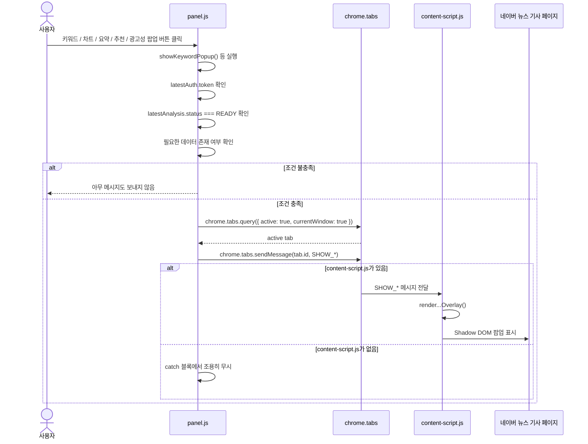
```mermaid
sequenceDiagram
  actor User as 사용자
  participant Panel as panel.js
  participant Tabs as chrome.tabs
  participant CS as content-script.js
  participant Page as 네이버 뉴스 기사 페이지

  User->>Panel: 키워드 / 차트 / 요약 / 추천 / 광고성 팝업 버튼 클릭
  Panel->>Panel: showKeywordPopup() 등 실행
  Panel->>Panel: latestAuth.token 확인
  Panel->>Panel: latestAnalysis.status === READY 확인
  Panel->>Panel: 필요한 데이터 존재 여부 확인
  alt 조건 불충족
    Panel-->>User: 아무 메시지도 보내지 않음
  else 조건 충족
    Panel->>Tabs: chrome.tabs.query({ active: true, currentWindow: true })
    Tabs-->>Panel: active tab
    Panel->>Tabs: chrome.tabs.sendMessage(tab.id, SHOW_*)
    alt content-script.js가 있음
      Tabs->>CS: SHOW_* 메시지 전달
      CS->>CS: render...Overlay()
      CS->>Page: Shadow DOM 팝업 표시
    else content-script.js가 없음
      Panel->>Panel: catch 블록에서 조용히 무시
    end
  end
```

팝업 버튼 함수:

- `showAdLikelihoodPopup()`
- `showKeywordPopup()`
- `showKeywordChartPopup()`
- `showSummaryPopup()`
- `showRecommendationsPopup()`
- `showAllPopups()`
- `hideAllPopups()`
- 공통 전송 함수: `sendActiveTabMessage(message)`

## 13. 사용자 흐름 J: content-script.js의 기사 페이지 처리

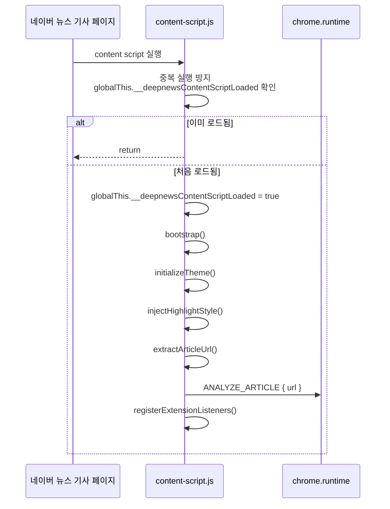
```mermaid
sequenceDiagram
  participant Page as 네이버 뉴스 기사 페이지
  participant CS as content-script.js
  participant Runtime as chrome.runtime

  Page->>CS: content script 실행
  CS->>CS: 중복 실행 방지<br/>globalThis.__deepnewsContentScriptLoaded 확인
  alt 이미 로드됨
    CS-->>Page: return
  else 처음 로드됨
    CS->>CS: globalThis.__deepnewsContentScriptLoaded = true
    CS->>CS: bootstrap()
    CS->>CS: initializeTheme()
    CS->>CS: injectHighlightStyle()
    CS->>CS: extractArticleUrl()
    CS->>Runtime: ANALYZE_ARTICLE { url }
    CS->>CS: registerExtensionListeners()
  end
```

중복 실행 방지 이유:

- 팝업 메시지 실패 복구 과정에서 과거에는 content script를 재주입했습니다.
- 같은 페이지에 같은 script가 다시 주입되면 `const ARTICLE_SELECTORS` 재선언 오류가 발생할 수 있습니다.
- 현재는 `globalThis.__deepnewsContentScriptLoaded`로 한 번 로드된 페이지에서는 추가 실행을 막습니다.

## 14. 사용자 흐름 K: content-script.js 팝업 렌더링 상세

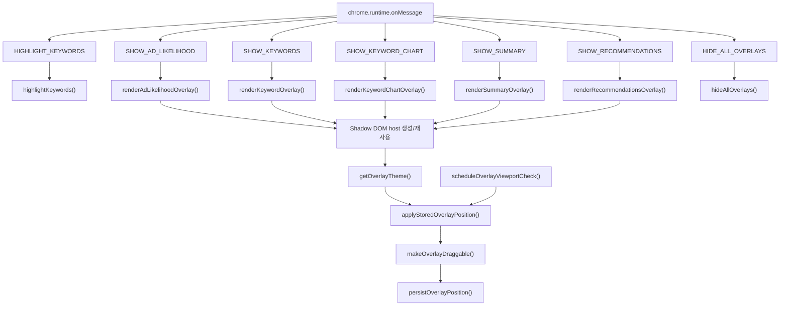
```mermaid
flowchart TD
  Message["chrome.runtime.onMessage"]

  Highlight["HIGHLIGHT_KEYWORDS"]
  ShowAd["SHOW_AD_LIKELIHOOD"]
  ShowKeywords["SHOW_KEYWORDS"]
  ShowChart["SHOW_KEYWORD_CHART"]
  ShowSummary["SHOW_SUMMARY"]
  ShowRecommendations["SHOW_RECOMMENDATIONS"]
  HideAll["HIDE_ALL_OVERLAYS"]

  HighlightFn["highlightKeywords()"]
  AdFn["renderAdLikelihoodOverlay()"]
  KeywordFn["renderKeywordOverlay()"]
  ChartFn["renderKeywordChartOverlay()"]
  SummaryFn["renderSummaryOverlay()"]
  RecommendationFn["renderRecommendationsOverlay()"]
  HideFn["hideAllOverlays()"]

  ShadowHost["Shadow DOM host 생성/재사용"]
  Theme["getOverlayTheme()"]
  Position["applyStoredOverlayPosition()"]
  Drag["makeOverlayDraggable()"]
  Persist["persistOverlayPosition()"]
  Viewport["scheduleOverlayViewportCheck()"]

  Message --> Highlight --> HighlightFn
  Message --> ShowAd --> AdFn
  Message --> ShowKeywords --> KeywordFn
  Message --> ShowChart --> ChartFn
  Message --> ShowSummary --> SummaryFn
  Message --> ShowRecommendations --> RecommendationFn
  Message --> HideAll --> HideFn

  AdFn --> ShadowHost
  KeywordFn --> ShadowHost
  ChartFn --> ShadowHost
  SummaryFn --> ShadowHost
  RecommendationFn --> ShadowHost

  ShadowHost --> Theme --> Position --> Drag
  Drag --> Persist
  Viewport --> Position
```

기사 페이지 팝업 함수:

- `renderAdLikelihoodOverlay(adLikelihood)`
- `renderKeywordOverlay(keywords)`
- `renderKeywordChartOverlay(keywords)`
- `renderSummaryOverlay(summary)`
- `renderRecommendationsOverlay(recommendations)`
- `hideAllOverlays()`
- `makeOverlayDraggable(host, handle)`
- `persistOverlayPosition(host)`
- `applyStoredOverlayPosition(host)`

## 15. 사용자 흐름 L: 로그아웃

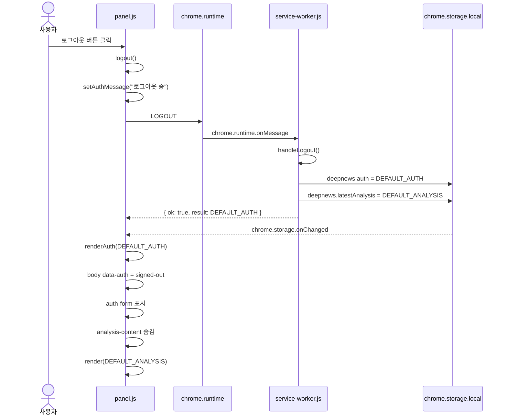
```mermaid
sequenceDiagram
  actor User as 사용자
  participant Panel as panel.js
  participant Runtime as chrome.runtime
  participant SW as service-worker.js
  participant Store as chrome.storage.local

  User->>Panel: 로그아웃 버튼 클릭
  Panel->>Panel: logout()
  Panel->>Panel: setAuthMessage("로그아웃 중")
  Panel->>Runtime: LOGOUT
  Runtime->>SW: chrome.runtime.onMessage
  SW->>SW: handleLogout()
  SW->>Store: deepnews.auth = DEFAULT_AUTH
  SW->>Store: deepnews.latestAnalysis = DEFAULT_ANALYSIS
  SW-->>Panel: { ok: true, result: DEFAULT_AUTH }
  Store-->>Panel: chrome.storage.onChanged
  Panel->>Panel: renderAuth(DEFAULT_AUTH)
  Panel->>Panel: body data-auth = signed-out
  Panel->>Panel: auth-form 표시
  Panel->>Panel: analysis-content 숨김
  Panel->>Panel: render(DEFAULT_ANALYSIS)
```

로그아웃 후 상태:

- 토큰 제거
- 분석 결과 초기화
- 로그인/회원가입 폼만 표시
- 분석 UI 숨김
- 팝업은 자동 제거하지 않습니다. 현재 백그라운드에서 탭 메시지 전송 오류를 방지하기 위해 자동 `HIDE_ALL_OVERLAYS` 전송을 제거한 상태입니다.

## 16. 사용자 흐름 M: 탭 변경/지원하지 않는 페이지 이동

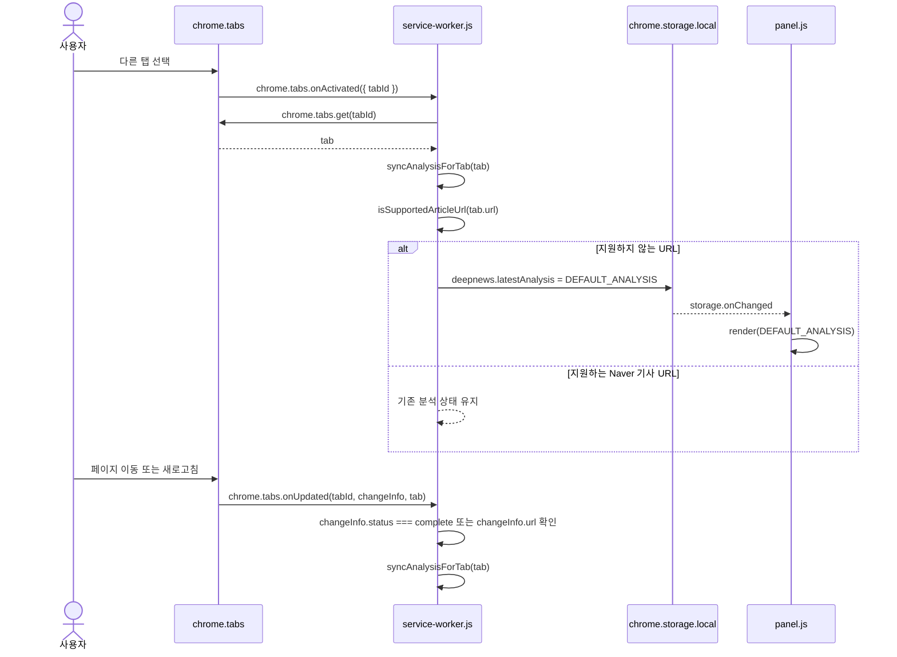
```mermaid
sequenceDiagram
  actor User as 사용자
  participant Tabs as chrome.tabs
  participant SW as service-worker.js
  participant Store as chrome.storage.local
  participant Panel as panel.js

  User->>Tabs: 다른 탭 선택
  Tabs->>SW: chrome.tabs.onActivated({ tabId })
  SW->>Tabs: chrome.tabs.get(tabId)
  Tabs-->>SW: tab
  SW->>SW: syncAnalysisForTab(tab)
  SW->>SW: isSupportedArticleUrl(tab.url)
  alt 지원하지 않는 URL
    SW->>Store: deepnews.latestAnalysis = DEFAULT_ANALYSIS
    Store-->>Panel: storage.onChanged
    Panel->>Panel: render(DEFAULT_ANALYSIS)
  else 지원하는 Naver 기사 URL
    SW-->>SW: 기존 분석 상태 유지
  end

  User->>Tabs: 페이지 이동 또는 새로고침
  Tabs->>SW: chrome.tabs.onUpdated(tabId, changeInfo, tab)
  SW->>SW: changeInfo.status === complete 또는 changeInfo.url 확인
  SW->>SW: syncAnalysisForTab(tab)
```

탭 상태 처리 정책:

- 지원하지 않는 페이지로 가면 분석 결과를 초기화합니다.
- 지원하는 네이버 뉴스 기사 URL이면 기존 분석 상태를 유지합니다.
- 실제 분석 시작은 content script가 `ANALYZE_ARTICLE`을 보내거나, 로그인 성공 후 `analyzeActiveTab()`이 실행될 때 발생합니다.

## 17. 저장소 구조

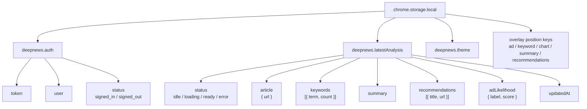
```mermaid
flowchart TD
  Store["chrome.storage.local"]

  AuthKey["deepnews.auth"]
  AnalysisKey["deepnews.latestAnalysis"]
  ThemeKey["deepnews.theme"]
  OverlayKeys["overlay position keys<br/>ad / keyword / chart / summary / recommendations"]

  AuthToken["token"]
  AuthUser["user"]
  AuthStatus["status<br/>signed_in / signed_out"]

  AnalysisStatus["status<br/>idle / loading / ready / error"]
  Article["article<br/>{ url }"]
  Keywords["keywords<br/>[{ term, count }]"]
  Summary["summary"]
  Recommendations["recommendations<br/>[{ title, url }]"]
  AdLikelihood["adLikelihood<br/>{ label, score }"]
  UpdatedAt["updatedAt"]

  Store --> AuthKey
  Store --> AnalysisKey
  Store --> ThemeKey
  Store --> OverlayKeys

  AuthKey --> AuthToken
  AuthKey --> AuthUser
  AuthKey --> AuthStatus

  AnalysisKey --> AnalysisStatus
  AnalysisKey --> Article
  AnalysisKey --> Keywords
  AnalysisKey --> Summary
  AnalysisKey --> Recommendations
  AnalysisKey --> AdLikelihood
  AnalysisKey --> UpdatedAt
```

## 18. 메시지 타입별 연결

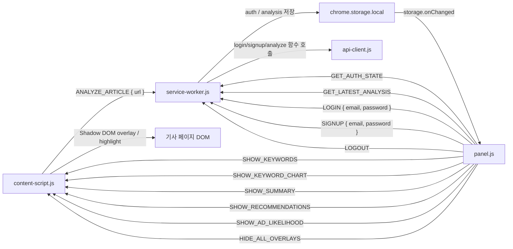
```mermaid
flowchart LR
  CS["content-script.js"]
  Panel["panel.js"]
  SW["service-worker.js"]
  Store["chrome.storage.local"]
  API["api-client.js"]
  Page["기사 페이지 DOM"]

  CS -->|"ANALYZE_ARTICLE { url }"| SW
  Panel -->|"GET_AUTH_STATE"| SW
  Panel -->|"GET_LATEST_ANALYSIS"| SW
  Panel -->|"LOGIN { email, password }"| SW
  Panel -->|"SIGNUP { email, password }"| SW
  Panel -->|"LOGOUT"| SW
  SW -->|"auth / analysis 저장"| Store
  Store -->|"storage.onChanged"| Panel
  SW -->|"login/signup/analyze 함수 호출"| API

  Panel -->|"SHOW_KEYWORDS"| CS
  Panel -->|"SHOW_KEYWORD_CHART"| CS
  Panel -->|"SHOW_SUMMARY"| CS
  Panel -->|"SHOW_RECOMMENDATIONS"| CS
  Panel -->|"SHOW_AD_LIKELIHOOD"| CS
  Panel -->|"HIDE_ALL_OVERLAYS"| CS
  CS -->|"Shadow DOM overlay / highlight"| Page
```

현재 메시지 정책:

- `service-worker.js`는 분석 완료 후 `SHOW_*` 메시지를 자동으로 보내지 않습니다.
- `SHOW_*` 메시지는 `panel.js`에서 사용자가 팝업 버튼을 눌렀을 때만 전송합니다.
- `panel.js`의 `sendActiveTabMessage()`는 전송 실패 시 catch에서 조용히 무시합니다.

## 19. 파일별 책임 상세

| 파일 | 주요 코드 | 실행 시점 | 책임 |
| --- | --- | --- | --- |
| `manifest.json` | `background`, `content_scripts`, `side_panel`, `permissions` | 확장 프로그램 로드 시 | 실행 진입점과 권한 선언 |
| `src/shared/constants.js` | `STORAGE_KEY`, `AUTH_STORAGE_KEY`, `MESSAGE_TYPES`, `ANALYSIS_STATUS`, `DEFAULT_AUTH`, `DEFAULT_ANALYSIS` | 여러 모듈에서 import | 공통 키/메시지/상태 모델 정의 |
| `src/background/api-client.js` | `login()` | 로그인 요청 시 | 백엔드 `/auth/login` 호출 또는 개발용 계정 인증 |
| `src/background/api-client.js` | `signup()` | 회원가입 요청 시 | 백엔드 `/auth/signup` 호출 또는 개발용 계정 인증 |
| `src/background/api-client.js` | `requestBackendAnalysis(url, token)` | 기사 분석 요청 시 | `/analyze`에 URL과 Authorization 헤더 전송, 실패 시 fallback 결과 반환 |
| `src/background/api-client.js` | `authenticateDevAccount()` | 백엔드 주소가 placeholder일 때 | `test@gmail.com / 1234` 개발용 로그인 처리 |
| `src/background/service-worker.js` | `chrome.runtime.onInstalled` | 설치/새로고침 시 | 기본 auth/analysis 상태 초기화 |
| `src/background/service-worker.js` | `chrome.action.onClicked` | 확장 아이콘 클릭 시 | 사이드패널 열기 |
| `src/background/service-worker.js` | `chrome.runtime.onMessage` | 패널/콘텐츠 메시지 수신 시 | 메시지 타입별 분기 처리 |
| `src/background/service-worker.js` | `handleLogin()` | `LOGIN` 메시지 수신 시 | 로그인 처리, auth 저장, 현재 탭 분석 |
| `src/background/service-worker.js` | `handleSignup()` | `SIGNUP` 메시지 수신 시 | 회원가입 처리, auth 저장, 현재 탭 분석 |
| `src/background/service-worker.js` | `handleLogout()` | `LOGOUT` 메시지 수신 시 | auth와 analysis 초기화 |
| `src/background/service-worker.js` | `analyzeArticle()` | `ANALYZE_ARTICLE` 또는 `analyzeActiveTab()` 실행 시 | 토큰 검사, URL 검사, loading/ready/error 상태 저장, 백엔드 분석 호출 |
| `src/background/service-worker.js` | `analyzeActiveTab()` | 로그인/회원가입 성공 후 | 현재 활성 탭이 네이버 기사이면 URL 분석 |
| `src/background/service-worker.js` | `syncAnalysisForTab()` | 탭 활성화/업데이트 시 | 지원하지 않는 페이지에서 분석 상태 초기화 |
| `src/panel/panel.html` | `auth-form`, `analysis-content` | 사이드패널 로드 시 | 인증 UI와 분석 UI 구조 제공 |
| `src/panel/panel.css` | `[data-auth="signed-out"]`, `.auth-card`, `.analysis-content` | 패널 렌더링 시 | 로그인 전/후 UI 표시 정책과 스타일 |
| `src/panel/panel.js` | `initialize()` | 패널 모듈 시작 시 | auth, latestAnalysis, theme 조회 |
| `src/panel/panel.js` | `renderAuth()` | auth 조회/변경 시 | 로그인 전 폼 표시, 로그인 후 분석 UI 표시 |
| `src/panel/panel.js` | `submitAuthForm()` | 로그인/회원가입 폼 제출 시 | 입력 검증, LOGIN/SIGNUP 메시지 전송 |
| `src/panel/panel.js` | `logout()` | 로그아웃 버튼 클릭 시 | LOGOUT 메시지 전송 |
| `src/panel/panel.js` | `render()` | 분석 결과 조회/변경 시 | 분석 결과 UI 갱신 |
| `src/panel/panel.js` | `show...Popup()` | 팝업 버튼 클릭 시 | 데이터/로그인 상태 확인 후 현재 탭으로 SHOW_* 메시지 전송 |
| `src/content/content-script.js` | `bootstrap()` | 네이버 뉴스 기사 페이지 로드 시 | 테마 초기화, 하이라이트 스타일 주입, URL 추출, 분석 메시지 전송 |
| `src/content/content-script.js` | `extractArticleUrl()` | bootstrap 중 | 현재 페이지 URL만 `{ url }`로 추출 |
| `src/content/content-script.js` | `registerExtensionListeners()` | content script 로드 시 | SHOW_* / HIDE_ALL_OVERLAYS 메시지 수신 등록 |
| `src/content/content-script.js` | `render...Overlay()` | 패널 팝업 메시지 수신 시 | 기사 페이지 Shadow DOM 팝업 표시 |
| `src/content/content-script.js` | `makeOverlayDraggable()`, `persistOverlayPosition()` | 팝업 드래그 시 | 팝업 위치 이동/저장 |

## 20. 현재 최종 사용자 흐름 요약

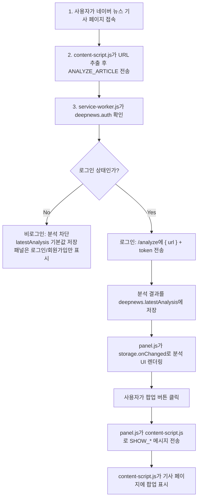
```mermaid
flowchart TD
  A["1. 사용자가 네이버 뉴스 기사 페이지 접속"]
  B["2. content-script.js가 URL 추출 후 ANALYZE_ARTICLE 전송"]
  C["3. service-worker.js가 deepnews.auth 확인"]
  D{"로그인 상태인가?"}
  E["비로그인: 분석 차단<br/>latestAnalysis 기본값 저장<br/>패널은 로그인/회원가입만 표시"]
  F["로그인: /analyze에 { url } + token 전송"]
  G["분석 결과를 deepnews.latestAnalysis에 저장"]
  H["panel.js가 storage.onChanged로 분석 UI 렌더링"]
  I["사용자가 팝업 버튼 클릭"]
  J["panel.js가 content-script.js로 SHOW_* 메시지 전송"]
  K["content-script.js가 기사 페이지에 팝업 표시"]

  A --> B --> C --> D
  D -->|"No"| E
  D -->|"Yes"| F --> G --> H --> I --> J --> K
```

## 21. 로그인 포함 핵심 발표 멘트

DeepNews는 로그인 전에는 분석 기능을 잠그고 로그인/회원가입 UI만 제공합니다. 사용자가 로그인하거나 회원가입하면 `panel.js`가 `LOGIN` 또는 `SIGNUP` 메시지를 `service-worker.js`로 보내고, `service-worker.js`는 `api-client.js`를 통해 인증을 처리한 뒤 `deepnews.auth`에 토큰과 사용자 정보를 저장합니다. 인증이 완료되면 현재 활성 탭이 네이버 뉴스 기사인지 확인하고, 기사 URL을 백엔드 `/analyze` API로 전달합니다. 분석 결과는 `deepnews.latestAnalysis`에 저장되며, 사이드패널은 `chrome.storage.onChanged`를 통해 자동으로 분석 UI를 갱신합니다. 기사 페이지 팝업은 자동으로 뜨지 않고, 사용자가 사이드패널의 팝업 버튼을 눌렀을 때만 `content-script.js`로 메시지를 보내 표시합니다.
